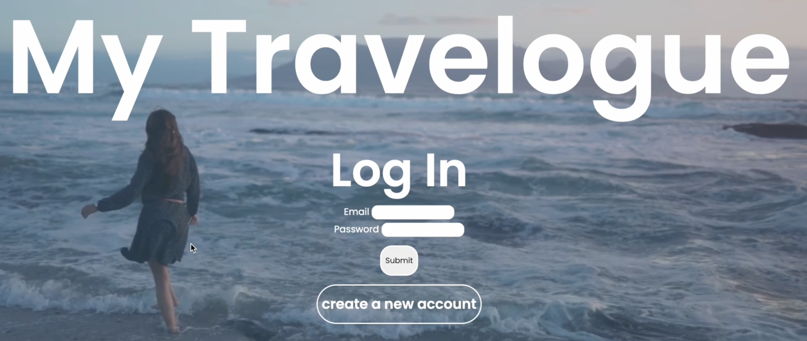
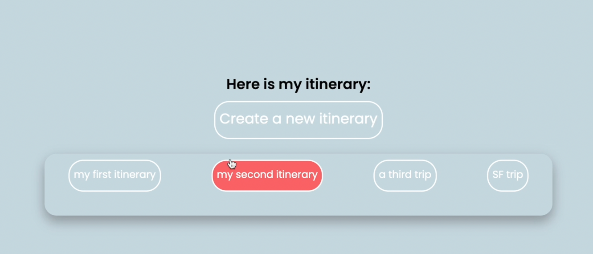
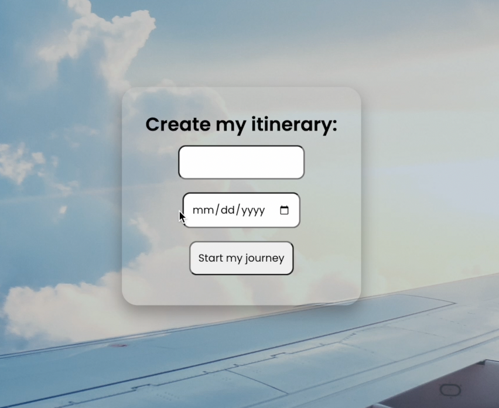
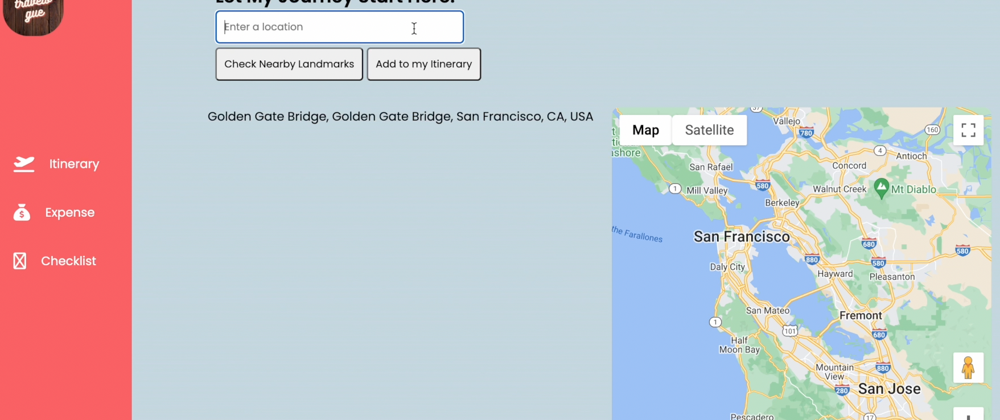
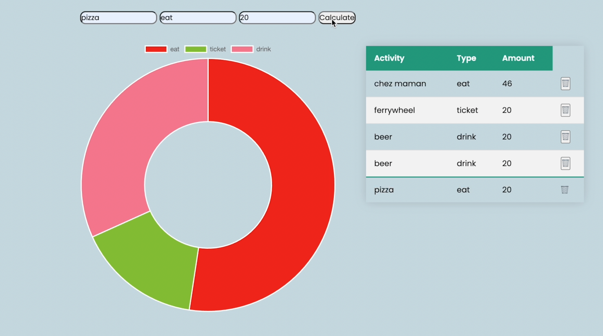
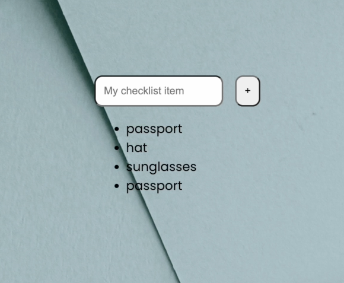

# My travelogue 
### An app  where users can manage their trip by searching for destinations, creating checklists, and tracking budgets.

## Technologies used
- Python
- JavaScript
- AJAX/JSON
- Flask
- Jinja
- React JS
- SQL / SQL Alchemy
- Chart.js
- Google Maps API / Google Places API
- HTML
- CSS

## Features
### [Check out the full video walk-through](https://www.youtube.com/watch?v=SzV_SUGsvzE)

### Login
- User can create an account or login
- Passwords are first checked and then saved to the database

### User Homepage
- User can view saved itineraries and create a new trip 

### Search nearby landmarks
- User can search destinations and check nearby landmarks

### Track expenses
- User can track travel budgets by entering expenses
- A visual donut chart is created to represent the expense based on different categories

### Create checklist
- User can create a checklist for different trip to stay organised

### Future Improvements
- Check if the newly added checklist item is already in the list, if so, alert the user accordingly
- Improve the appearance of the carousel 

## About Me
Hi, I'm Emma, a software engineer. In the past, I was a teacher and a flight attendant. This is my first full stack app which I created in four weeks as my final project at Hackbright.
Feel free to contact me on [Linkedin](https://www.linkedin.com/in/binmaemma/).

